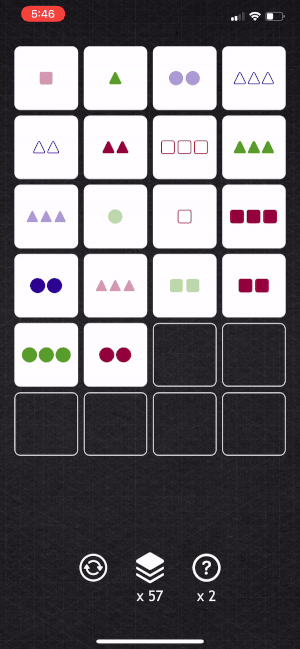

# Set

## Dean Stratakos
### April 2, 2020

[**Set**](https://en.wikipedia.org/wiki/Set_(card_game)) is a card game that starts
out with a deck of 81 unique cards. Each card has four features with three possibilities
each:
- number of shapes: 1, 2, or 3
- shape: circle, square, or triangle
- shading: solid, shaded, or open
- color: red, green, blue

The objective of the game is to match all of the cards in the deck into "sets" of three.
See these [rules](https://en.wikipedia.org/wiki/Set_(card_game)) for more details.

Time spent: **30** hours spent in total

## Functionality 

The following functionality is completed:

* [x] The cards show different colors and animations whenever selected (yellow), matched
in a valid set (green pulse), or matched in an invalid set (red shake).
* [x] Selected cards can be deselected.
* [x] At the bottom of the app are three minimalistic buttons:
    * [x] The left button starts a new game
    * [x] The middle button draws three more cards, either replacing cards if there is a
    match on the board, or adding three more cards to the board. The button is disabled
    if there are no more cards left or if the board is full.
    * [x] The right button shows a hint and is disabled if there are no more hints remaining.
* [x] The player is allotted three hints per game, where a hint will select two out of
three cards that make up a set or light up the middle button to indicate that there are no
moves on the board and the player should deal three more cards.
* [x] Portrait and landscape orientation are supported.

## Video Walkthrough

First, here is a basic set match:

This video demonstrates dealing three more cards:

Here is a video showing deselection and the incorrect animation:

And finally, this video shows how to use a hint:

## Notes

Given more time, I would like to create custom styling of the icons on the cards. I would also
like to implement more animations of the cards being dealt and matched as well as dynamic
resizing.

## License

    Copyright 2020 Dean Stratakos

    Licensed under the Apache License, Version 2.0 (the "License");
    you may not use this file except in compliance with the License.
    You may obtain a copy of the License at

        http://www.apache.org/licenses/LICENSE-2.0

    Unless required by applicable law or agreed to in writing, software
    distributed under the License is distributed on an "AS IS" BASIS,
    WITHOUT WARRANTIES OR CONDITIONS OF ANY KIND, either express or implied.
    See the License for the specific language governing permissions and
    limitations under the License.
